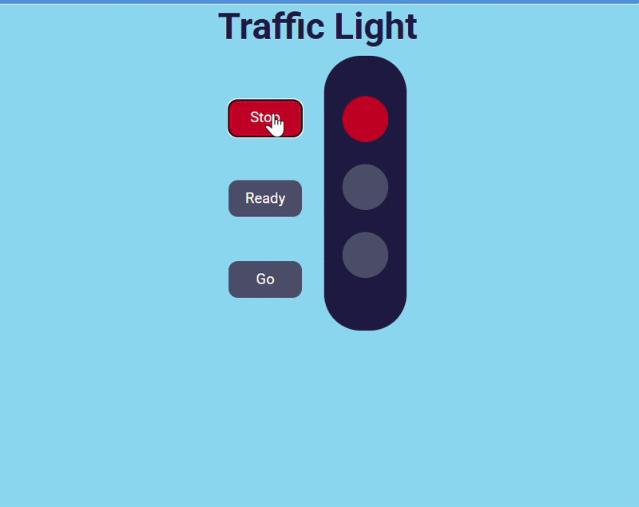

# 🚦 Traffic Light Project

This is a simple **Traffic Light Simulation** built using **HTML, CSS, and JavaScript**.  
It demonstrates how traffic signals work with **Stop, Ready, and Go** buttons that change the light color accordingly.

## 📌 Features
- 🎨 Interactive UI with buttons to switch between **Red, Yellow, and Green**.
- 🖥️ Built using **HTML, CSS, JavaScript** 

## 🛠️ Tech Stack
- **HTML5** – Structure  
- **CSS3** – Styling  
- **JavaScript** – Functionality  

## 🚀 Live Demo
👉 
